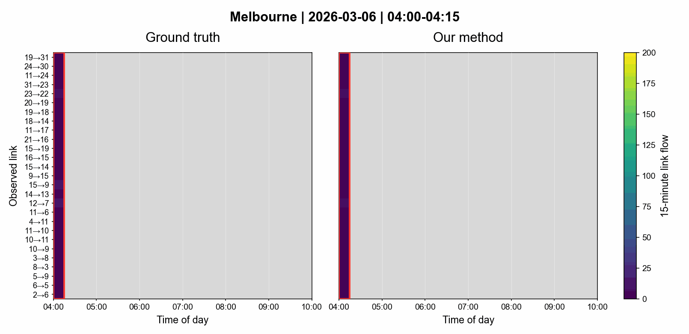
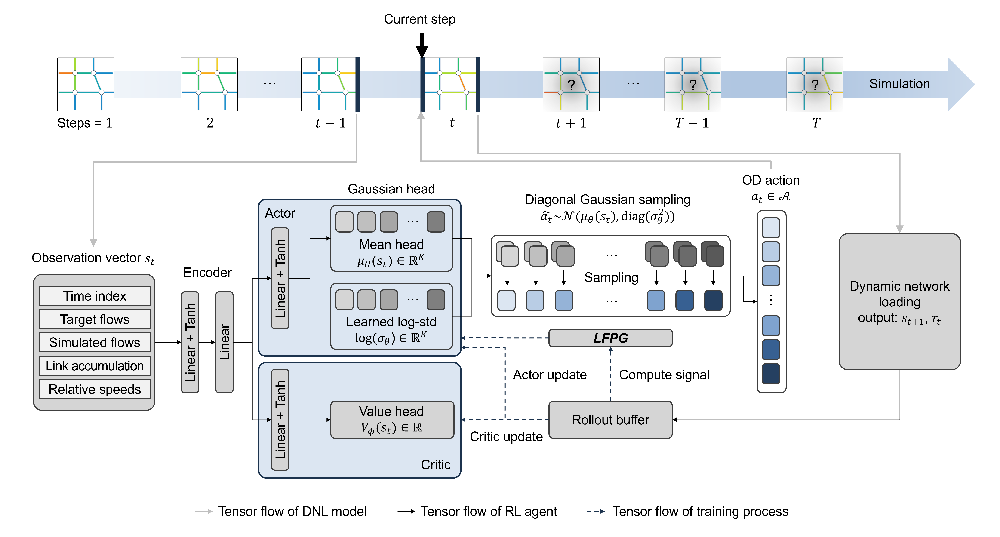

# Online Estimation of Dynamic Origin-Destination Matrices Using Reinforcement Learning with Link-Flow Propagation Guidance

<p align="center">
  
  <br>
  <sub>Please click the GIF!</sub>
</p>

This repository provides the implementation package for LFPG-RL, an
online dynamic origin-destination (OD) matrix estimation (DODE) framework that
calibrates time-dependent OD demand to reproduce observed link-flow
trajectories.

## Overview

- ❓ **What is the problem?** RL can reduce the online computational burden of DODE
  by replacing iterative updates with a policy forward pass, but the policy is
  trained offline and must generalize to varying target link-flow trajectories
  at deployment.
  
- 🎯 **Why is standard RL limited?** In online DODE, each
  target trajectory defines the link-flow error used in the reward. As a result,
  scalar rewards and step-level advantages can evaluate an OD demand vector as a
  whole, but they do not explain which OD-time components caused downstream
  residuals. This hinders the generalization of policies for online DODE.
  
- 🧭 **What does LFPG provide?** Link-Flow Propagation Guidance (LFPG) uses completed DNL rollouts to record how
  each OD-time demand component contributes to downstream link flows, then
  combines those propagated contributions with link-flow residuals.
  
- 🤖 **How is LFPG used in RL?** LFPG-RL keeps PPO as the policy-learning
  backbone and adds an LFPG shaping term so actor updates are informed by
  realized propagation patterns and local reward sensitivities.
  
- ⚡ **What is the outcome?** Given a new target link-flow trajectory, LFPG-RL can
  calibrate OD demand almost instantly with a single policy forward pass,
  without iterative online search.


## Concept

<p align="center">
  
  <br>
  <sub>Our framework for online OD demand calibration</sub>
</p>

## Installation

Create a Python environment, then install the pinned runtime dependencies from
the repository root:

```powershell
python -m pip install -r requirements.txt
```

## Public Contents

| Path | Purpose |
| --- | --- |
| `train.py` | Launch RL training runs. |
| `test.py` | Launch held-out evaluation runs. |
| `dnl/` | Link transmission model, DNL driver, kernels, path logic, and network registry. |
| `dnl/network/melbourne_scats_metadata.json` | Topology metadata used by the Melbourne network builder. |
| `data/train_dataset.npz` | Train split. |
| `data/test_dataset.npz` | Test split. |
| `methods/` | Method entry points for policy learning, online optimization, and filtering baselines. |
| `params/` | DNL, RL, and baseline parameters. |
| `utils/` | Dataset loading, result IO, LFPG-RL runner, baseline support, and shared helpers. |


## Network

The active case study is `melbourne_scats`.

| Item | Count |
| --- | ---: |
| Nodes | 31 |
| Links | 78 |
| Number of OD pairs | 930 |
| Time steps | 24 |
| External bin size | 15 minutes |
| Internal DNL step | 1 minute |


## Dataset

| Split | Days | Target-observation shape | File |
| --- | ---: | --- | --- |
| Train | 220 | `(220, 24, 27)` | `data/train_dataset.npz` |
| Test | 30 | `(30, 24, 27)` | `data/test_dataset.npz` |

The public split files store detector-observation targets, not observed OD
matrices. The action/estimation space is the 930-dimensional directed OD pair
space, while evaluation compares simulated link flows only on the 27 observed
detector-linked rows.

The current split uses 250 total daily episodes, with 220 train days and 30
held-out test days.

The split NPZ files are derived from Victorian Department of Transport and
Planning Open Data, "Traffic Signal Volume Data", which is sourced from SCATS
traffic-signal detector loops and published as 15-minute detector counts. The
source monthly resources used for this project are listed by the public data
catalogue under Creative Commons Attribution 3.0 Australia:

- Source catalogue: <https://data.gov.au/data/dataset/traffic-signal-volume-data>
- Data licence: <https://creativecommons.org/licenses/by/3.0/au/>

See `LICENSE` for the software license and data attribution notice.

The checked Melbourne topology metadata includes road-network information
derived from OpenStreetMap. OpenStreetMap data is licensed under the Open Data
Commons Open Database License (ODbL).

## Training

Default training launches LFPG-RL and PPO for trials `201 202 203 204 205`.

```powershell
python train.py
```

Current launcher defaults:

| Setting | Value |
| --- | --- |
| Methods | `lfpg_rl ppo_baseline` |
| Trials | `201 202 203 204 205` |
| Child seed | trial index by default |
| Scheduling | all method/trial tasks in parallel |
| Runtime cap | 20 hours per child run |
| Vector envs | 4 |
| Subprocess vector envs | disabled |

Examples:

```powershell
python train.py --methods lfpg_rl ppo_baseline --trials 201 202 203 204 205
python train.py --methods ppo_baseline --trials 201 --runtime-seconds 10 --sequential --no-use-subproc
```

## Evaluation

Default evaluation follows `TEST_METHODS` in `test.py` exactly.
The current default list contains only non-RL baselines. To evaluate RL methods,
set their checkpoint paths first and select them with `--methods`.

```powershell
python test.py
```

Current evaluation defaults:

| Setting | Value |
| --- | --- |
| Methods | `lfpg_gd w_spsa lfpg_kf kf` |
| Test scenarios | all 30 scenarios in `test_dataset.npz` |
| Passes per method | one full test split pass |
| Scheduling | parallel by default |
| Parallel batch size | `NUM_PARALLEL_ENV=6` scenarios per method |
| Child processes per round | 24 = 4 methods x 6 scenarios |
| Rounds | 5 = 30 test scenarios / 6 scenarios per round |
| Per-step runtime cap | 15 minutes |

Parallel evaluation writes each completed scenario immediately under:

```text
methods/<method>/results/Melbourne SCATS_test/<scenario_id>/
```

After all 30 scenarios for a method finish, `test.py` refreshes only the
method-level `test_summary.json` and `config_snapshot.json`. Numeric outputs
remain scenario-folder based; root-level aggregate `test_outputs.npz` files are
not part of the active output contract.

To evaluate trained RL policies, set the checkpoint paths at the top of
`test.py`:

```python
LFPG_RL_POLICY = r"...\final_model.pt"
RL_POLICY = r"...\final_model.pt"
```

Then run the default evaluation or select the RL methods explicitly:

```powershell
python test.py
python test.py --methods lfpg_rl ppo_baseline
```

Specific non-RL method families can be selected explicitly:

```powershell
python test.py --methods lfpg_gd w_spsa lfpg_kf kf
```

Use `--sequential` to force one selected method at a time over the full test
split.

## Methods

| Method key | Folder | Family |
| --- | --- | --- |
| `lfpg_rl` | `methods/1-1. LFPG-RL/` | Policy learning with LFPG guidance |
| `ppo_baseline` | `methods/1-2. PPO/` | Policy learning baseline |
| `lfpg_gd` | `methods/2-1. LFPG-GD/` | LFPG-guided online optimization |
| `w_spsa` | `methods/2-2. W-SPSA/` | Online optimization baseline |
| `lfpg_kf` | `methods/3-1. LFPG-KF/` | LFPG-guided sequential filtering |
| `kf` | `methods/3-2. KF/` | Sequential filtering baseline |

All evaluation methods are causal online methods. They may use the current
target row at each step, but not future target rows.

## License

Repository software is released for non-commercial research, educational, and
evaluation purposes only. Commercial use requires prior written permission from
the copyright holder, and patent rights are reserved except as stated in
`LICENSE`. The train/test NPZ files under `data/` are derived from Victorian
Department of Transport and Planning Traffic Signal Volume Data and remain
subject to the source data licence and attribution requirements. The Melbourne
topology metadata includes OpenStreetMap-derived road-network data and remains
subject to ODbL attribution requirements. See `LICENSE`.
